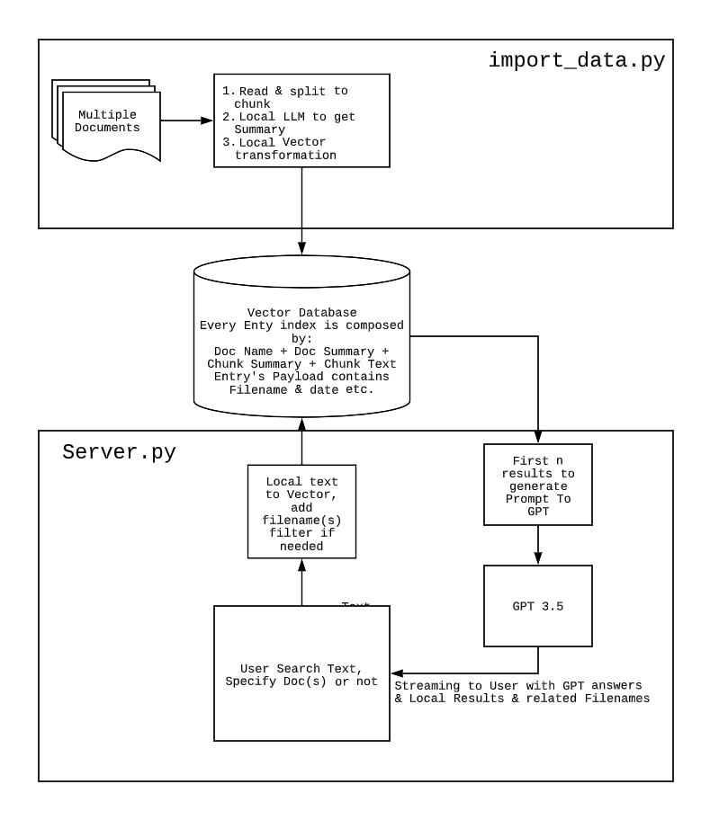

# document.ai
基于向量数据库与GPT3.5的通用本地知识库方案(A universal local knowledge base solution based on vector database and GPT3.5)

## 目录

 `code` 目录中有本次MSD示例的相关示例代码

## 流程

整个流程非常简单，也没有复杂的地方，相信关注GPT领域的都会看到过如上的流程。

主要就以下几个点：

- 将本地答案数据集，转为向量存储到向量数据
- 当用户输入查询的问题时，把问题转为向量然后从向量数据库中查询相近的答案topK
  这个时候其实就是我们最普遍的问答查询方案，在没有GPT的时候就直接返回相关的答案整个流程就结束了
- 现在有GPT了可以优化回答内容的整体结构，在单纯的搜索场景下其实这个优化没什么意义。但如果在客服等的聊天场景下，引用相关领域内容回复时，这样就会显得不那么的突兀。

## 使用范围
请参考 OpenAI 的使用政策

https://openai.com/policies/usage-policies

我的 MSD 案例只是探索其中一个垂直领域的可行性，你可以把这个项目迁移到任何你熟悉的领域中，而不必拘泥于医疗领域

## 难点

### 查询数据不准确

#### 基于数据的优化

##### 问答拆分查询

在上面的例子中，我们直接将问题和答案做匹配，有些时候因为问题的模糊性会导致匹配不相关的答案。

如果在已经有大量的问答映射数据的情况下，问题直接搜索问题集，然后基于已有映射返回当前问题匹配的问题集的答案，这样可以提升一定的问题准确性。

##### 抽取主题词生成向量数据
因为答案中有大量非答案的内容，可以通过抽取答案主题然后组合生成向量数据，也可以在一定程度上提升相似度，主题算法有LDA、LSA等。

#### 基于自训练的Embedding模型

openAI 的Embedding模型数据更多是基于普遍性数据训练，如果你要做问答的领域太过于专业有可能就会出现查询数据不准确的情况。

解决方案是自训练 Embedding 模型，在这里我推荐一个项目 [text2vec](https://github.com/shibing624/text2vec) ，shibing624 已经给出了一个模型基于 `CoSENT + MacBERT +STS-B`，[shibing624/text2vec-base-chinese](https://huggingface.co/shibing624/text2vec-base-chinese)。

我也在前些日子训练了基于 `CoSENT + LERT + STS-B`的两个模型一个隐层大小是1024的[text2vec-large-chinese](https://huggingface.co/GanymedeNil/text2vec-large-chinese)，另一个是768的[text2vec-base-chinese](https://huggingface.co/GanymedeNil/text2vec-base-chinese)。也欢迎比对。

为了做这个Demo我还训练了两个医疗问答相关的模型基于`cMedQQ`数据集，其他与上面的一致分别是[text2vec-cmedqq-lert-large](https://huggingface.co/GanymedeNil/text2vec-cmedqq-lert-large)和[text2vec-cmedqq-lert-base](https://huggingface.co/GanymedeNil/text2vec-cmedqq-lert-base)。

#### 基于 Fine-tune
目前我自身测试下来，使用问答数据集对GPT模型进行Fine-tune后，问答准确性会大幅提高。你可以理解为GPT通过大量的专业领域数据的学习后成为了该领域专家，然后配合调小接口中`temperature`参数，可以得到更准确的结果。

但 现在 Fine-tune 训练和使用成本还是太高，每天都会有新的数据，不可能高频的进行 Fine-tune。我的一个想法是每隔一个长周期对数据进行 Fine-tune ，然后配合外置的向量数据库的相似查询来补足 Fine-tune 模型本身的数据落后问题。

## Buy me a coffee

