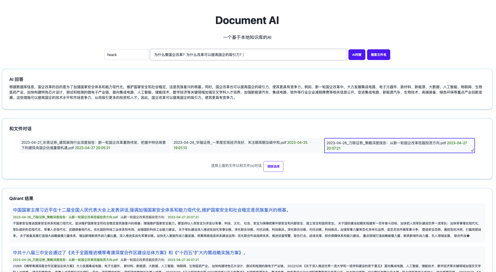

<h1 align="center">
  ChatDocs
</h1>

  <strong>开源本地文档智能对话AI Open Source Local Documents Based AI</strong>

  <strong>ChatDocs</strong> 可以对本地文档进行索引，并通过调用GPT接口，整合信息进行本地文档智能对话。相对于在线GPT，本程序有以下功能：
  
1. 可以对本地文档进行索引，目前支持PDF/PPTX/DOCX/TXT，未来会支持更多。这里的信息在线GPT不可能知道，也无法提供帮助。

  
2. 对本地文档索引可以形成独立人格的只属于个人或者公司的知识库，而且会对各个文档的内容进行串联，形成一个贾维斯式大脑，大大提升工作效率和决策效率

  
3. 既支持和所有文件进行统一搜索，也支持针对特定文件(一个或多个)进行统一问询，大大增加知识获取的广度和深度

### 流程

### 首页

### 搜索所有数据库，同时会把相关文档列出来，可以进一步选择文档(s)进行深度对话。

### 选择具体文档进行对话

## 主要文件

1. `code/server/server.py`: 基于Flask服务器程序，http网址默认端口3000 http://localhost:3000
2. `code/data_import/import_data.py`: 索引文件，目前支持pdf/docx/pptx/txt后缀文件，其他文件会忽略
3. `config.json`: 配置文件，其中base_dir是配置collection_name和索引文件所在路径。users是登录的用户名，本地访问会忽略登录这一步

### 环境要求

- Python 3.8+ (基于此环境开发的)

## 安装和使用

1. 配置config.json，上面有提到
2. 分别进入code/server和code/data_import目录，按照相应的README进行配置和运行

## 致谢

感谢原作者（GitHub用户名GanymedeNil）的项目（https://github.com/GanymedeNil/document.ai）
提供了一个非常好的基础框架，本项目基于其框架进行了大量修改和改进。

## 许可
如商用，请联系我。

## Buy me a coffee

